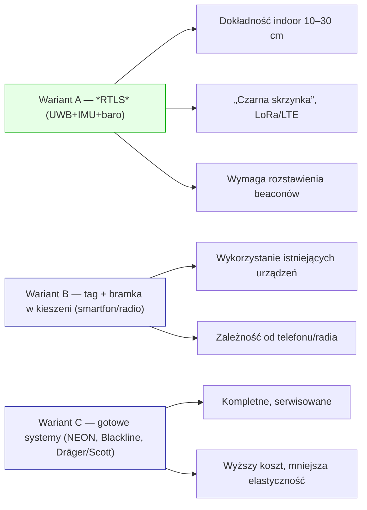

# HackNation

JAK ODPALIĆ

1. install npm
```bash
sudo apt install npm
```
2. install nodejs
```bash
npm install
```

3. download node js
```bash
# Download and install nvm:
curl -o- https://raw.githubusercontent.com/nvm-sh/nvm/v0.40.3/install.sh | bash

# in lieu of restarting the shell
\. "$HOME/.nvm/nvm.sh"

# Download and install Node.js:
nvm install 18

# Verify the Node.js version:
node -v # Should print "v18.20.8".

# Verify npm version:
npm -v # Should print "10.8.2".
```
4. install dependencies
```bash
npm install
```

5. start dev server
```bash
npm start
``` 

TEST WYKRESIKU

*Diagram 2. Warianty rozwiązania — mapa opcji.*

