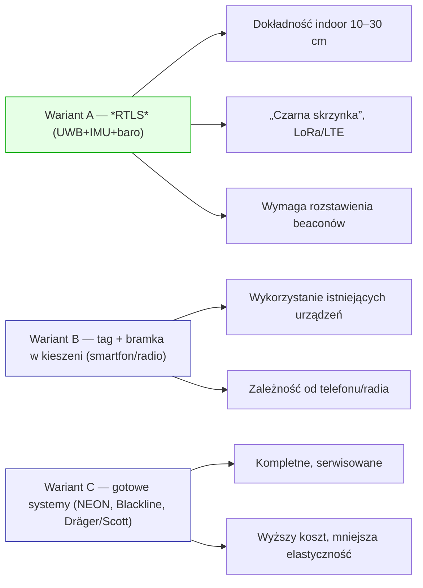

# HackNation

TEST WYKRESIKU

*Diagram 2. Warianty rozwiązania — mapa opcji.*

```mermaid
flowchart LR
  A["Wariant A — *RTLS* (UWB+IMU+baro)"]:::good
  B["Wariant B — tag + bramka w kieszeni (smartfon/radio)"]:::neutral
  C["Wariant C — gotowe systemy (NEON, Blackline, Dräger/Scott)"]:::neutral

  A --> A1["Dokładność indoor 10–30 cm"]
  A --> A2["„Czarna skrzynka”, LoRa/LTE"]
  A --> A3["Wymaga rozstawienia beaconów"]

  B --> B1["Wykorzystanie istniejących urządzeń"]
  B --> B2["Zależność od telefonu/radia"]

  C --> C1["Kompletne, serwisowane"]
  C --> C2["Wyższy koszt, mniejsza elastyczność"]

  classDef good fill:#e6ffe6,stroke:#0a0,stroke-width:1px;
  classDef neutral fill:#eef,stroke:#33a,stroke-width:1px;
```